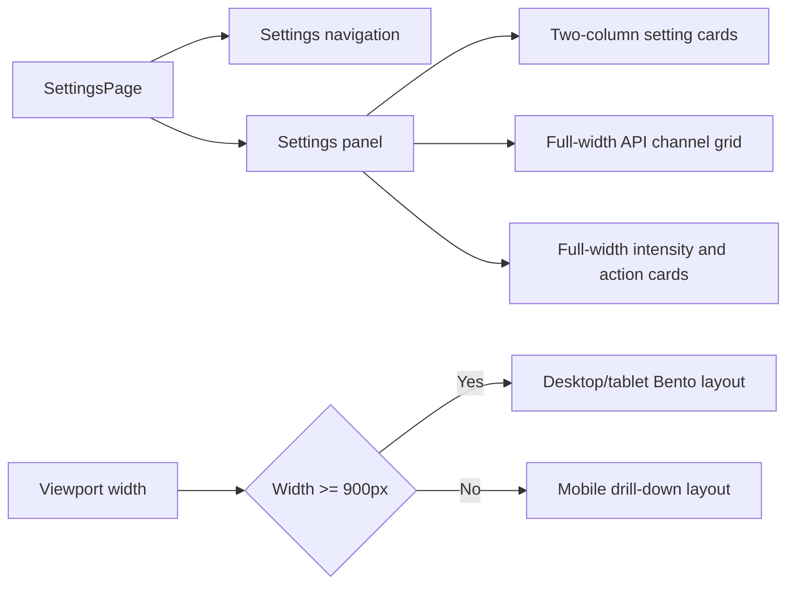

# 设置页 Bento Grid 设计

Feature Name: settings-bento-grid  
Updated: 2026-07-27

## 描述

设置页采用响应式 Bento Grid 组织桌面端和平板横向视口中的设置内容。`900px` 以上使用侧边导航、双列配置卡片和完整宽度核心区块；`900px` 以下继续沿用现有移动端下钻布局。

## 架构

## 组件与接口

- `SettingsPage` 继续负责主题切换、API 渠道操作、UI 偏好和高级设置状态。
- `Settings.css` 的 `@media (min-width: 900px)` 规则负责 Bento 网格，不改变移动端媒体查询。
- `.settings-layout` 提供导航列和内容列。
- `.settings-list` 在桌面端使用两列网格，跨主题卡片使用完整列跨度。
- `.settings-form` 在桌面端使用两列字段网格，API 渠道列表和编辑区使用完整列跨度。
- `.provider-grid` 在桌面端使用两列渠道卡片。

## 数据模型

布局不改变设置数据模型。现有 `ChatPrefs`、`ReadingPrefs`、`ChannelPublic`、`SettingsBackupAgent` 和 Agent 配置接口继续作为数据源。

## 正确性约束

1. `max-width: 899px` 的现有移动端布局规则保持有效。
2. 桌面端所有核心内容区块保持完整宽度，短配置项使用两列。
3. API 渠道卡片在渠道数量变化后保持网格排列。
4. 主题导航与设置内容保持统一圆角、边界和间距尺度。
5. 页面内容超出视口时，导航和内容仍可访问。

## 错误处理

- API 数据加载和保存继续使用既有 Toast 提示。
- Bento 布局只改变展示结构，不改变错误处理和提交逻辑。
- 视口尺寸变化由 CSS 媒体查询处理，运行时状态不依赖固定窗口宽度。

## 测试策略

- 执行 `npm run build` 验证 TypeScript、React 和 CSS 构建。
- 执行 `npm run mobile:smoke` 验证移动端运行时不受设置页样式变更影响。
- 在宽度 `900px`、平板横向宽度和桌面宽度检查导航、API 渠道卡片与字段网格。
- 在宽度 `899px`、手机宽度检查移动端下钻流程未改变。

## 参考

- [CSS Grid 布局完全指南](https://css-tricks.com/snippets/css/complete-guide-grid/) - CSS-Tricks
- [共同区域法则](https://lawsofux.com/law-of-common-region/) - Laws of UX
- `drawdream/src/pages/Settings.tsx`
- `drawdream/src/pages/Settings.css`
