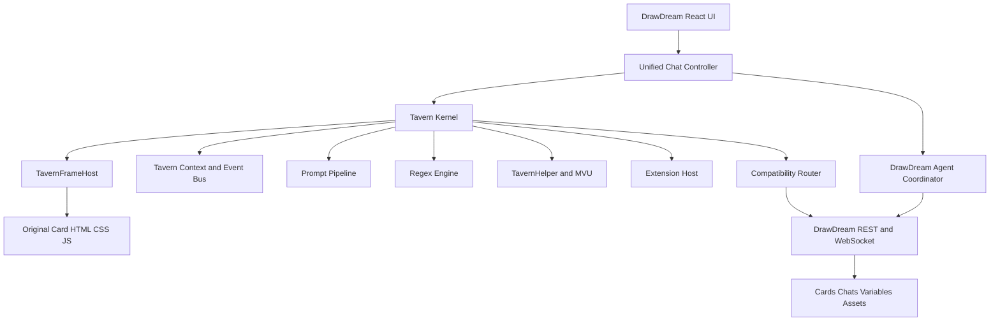

# DrawDream 酒馆兼容内核设计

Feature Name: tavern-kernel-integration
Updated: 2026-07-30
Release: `v2.0.0-alpha.1-mobile.38`
Status: Implemented; Android device validation remains an external release check.

## Description

本设计将 DrawDream 扩展为单一 React 产品 UI 与酒馆兼容内核的融合系统。系统参考 PureTavern 的 Compatibility Router、Feature Module 和 Capability Port 思路，复刻 SillyTavern 的核心行为协议，并把角色卡原始 UI 放入现有消息渲染树的受控 frame。

DrawDream 负责产品外壳、Agent 编排、搜索、工具、来源引用、会话连接和 Android Node 服务。Tavern Kernel 负责酒馆 Context、事件、Prompt Pipeline、Regex、宏、World Info、Extension API、TavernHelper、MVU 和原卡 UI Bridge。两者通过统一 Chat Controller 和兼容 API 协作。

## Architecture



## Runtime Modes

```ts
type ChatRuntimeMode = 'drawdream' | 'tavern' | 'hybrid'
```

- `drawdream`：沿用当前 Agent pipeline。
- `tavern`：由 Tavern Kernel 组装 SillyTavern 语义 Prompt，DrawDream 负责模型传输。
- `hybrid`：保留酒馆 Prompt、Regex、MVU 和原卡 UI，同时由 Agent 决定搜索和工具调用。

导入含酒馆扩展的角色卡时，默认使用 `hybrid`。用户可以按会话切换模式，模式切换只改变生成协调器，不改变消息和变量存储。

## Components and Interfaces

### Directory Boundaries

```text
drawdream/src/tavern/
  kernel/
  pipeline/
  runtime/
  extensions/
  api/
  react/
  diagnostics/

drawdream/agent/src/tavern/
drawdream/agent/server/rest/routes/tavern/
```

### Tavern Kernel

```ts
interface TavernKernel {
  getContext(): TavernContext
  events: TavernEventBus
  prompt(input: GenerationInput): Promise<PromptAssembly>
  variables: MvuStore
  executeSlash(command: string): Promise<SlashResult>
  openCard(cardId: string): Promise<void>
  openChat(chatId: string): Promise<void>
}
```

Kernel SHALL remain independent from React. React adapters subscribe to events and expose render nodes. Agent adapters call Kernel through typed interfaces.

### Unified Chat Controller

```ts
interface UnifiedChatController {
  send(text: string, options?: SendOptions): Promise<void>
  stop(): void
  reroll(messageId?: string): Promise<void>
  swipe(messageId: string, direction: -1 | 1): Promise<void>
  edit(messageId: string, text: string): Promise<void>
  delete(messageId: string): Promise<void>
  getContext(): TavernContext
}
```

所有输入框、卡内按钮、TavernHelper 和 Agent 操作通过该控制器进入同一生成锁和消息事务。

### Context and Event Bus

```ts
interface TavernContext {
  chatId: string
  characterId: string
  name1: string
  name2: string
  chat: TavernMessage[]
  chatMetadata: JsonObject
  extensionSettings: JsonObject
  onlineStatus: string
  maxContext: number
  sendMessage(text: string): Promise<void>
  stopGeneration(): void
  regenerateMessage(messageId?: string): Promise<void>
  swipeLeft(messageId: string): Promise<void>
  swipeRight(messageId: string): Promise<void>
}

interface TavernEvent<T> {
  sequence: number
  sessionRevision: number
  type: string
  payload: T
}
```

核心事件包含 `APP_READY`、`CHAT_CHANGED`、`MESSAGE_SENT`、`MESSAGE_RECEIVED`、`MESSAGE_UPDATED`、`MESSAGE_SWIPED`、`GENERATION_STARTED`、`GENERATION_ENDED`、`VARIABLES_UPDATED` 和 `CHAT_METADATA_UPDATED`。

### Message AST

```ts
type TavernMessageNode =
  | { type: 'markdown'; source: string }
  | { type: 'html'; source: string; scripts: boolean }
  | { type: 'iframe'; document: string; capabilities: string[] }
  | { type: 'agent-activity'; activityId: string }
  | { type: 'tool-result'; toolCallId: string }
```

原始 assistant 输出先进入 Kernel 处理，再形成 AST。Agent 活动、搜索来源和原卡 UI 作为同一消息的相邻节点，保留 DrawDream 的原生可观测能力。

### TavernFrameHost

`CardHtmlFrame` 升级为 `TavernFrameHost`。卡片 UI 在消息级 `iframe` 中运行，父页面保留 DrawDream React 主上下文。

```ts
interface TavernFrameRequest {
  protocol: 'drawdream-tavern-frame'
  version: 1
  frameId: string
  capabilityToken: string
  requestId: string
  type: 'context.get' | 'variables.get' | 'variables.patch' | 'message.send' | 'message.update' | 'slash.execute' | 'event.subscribe' | 'asset.resolve' | 'frame.resize'
  payload?: JsonValue
}
```

父页面校验 `event.source`、`frameId`、token、messageId、capability、payload schema、请求大小和频率。`event.origin` 作为辅助校验，不能作为 opaque sandbox frame 的唯一身份判断。

### Compatibility API

```ts
class TavernCompatibilityRouter {
  register(method: string, path: string, handler: TavernHandler): void
  dispatch(request: Request): Promise<Response | null>
}
```

浏览器侧提供 SillyTavern 风格 API facade，服务端提供同语义的 `/api/tavern/v1/*` 数据接口。核心映射如下：

| 酒馆能力 | DrawDream 服务 |
|---|---|
| `/api/characters/*` | 角色卡、原始文件、头像和运行时清单 |
| `/api/chats/*` | session、message、swipe 和 metadata |
| `/api/worldinfo/*` | World Book repository |
| `/api/extensions/*` | 扩展 registry、设置和资源 |
| `/api/backends/chat-completions/*` | Hybrid Generation Coordinator |
| `/api/tokenizers/*` | DrawDream token estimate adapter |

写操作携带 `id` 和 `revision`，服务端执行条件写入；冲突返回 `409` 并携带当前 revision。

## Data Models

### Card Runtime Manifest

```ts
interface TavernRuntimeManifest {
  version: 1
  cardFingerprint: string
  requiredCapabilities: string[]
  regexScripts: CardRegexScript[]
  extensionScripts: JsonObject[]
  externalModules: { url: string; hash?: string }[]
  placeholders: string[]
  worldBooks: string[]
  initialVariables: JsonObject
  diagnostics: RuntimeDiagnostic[]
}
```

原始 Card JSON 和 PNG 字节始终保存。规范化 Card 用于 Kernel，Manifest 用于能力检查、初始化和诊断。

### Tavern Message

```ts
interface TavernStoredMessage {
  id: string
  parentId: string | null
  role: 'user' | 'assistant' | 'system'
  name: string
  rawText: string
  displayText?: string
  sendDate: string
  extra: JsonObject
  metadata: JsonObject
  variables: JsonObject
  swipes: TavernSwipe[]
  selectedSwipe: number
  revision: number
  runtime: {
    regexTrace?: RegexTrace[]
    variableOperations?: VariableOperation[]
    uiManifest?: JsonObject
  }
}
```

现有 `chatlog.ts` 的 sidecar 字段迁移到该模型，保留 `send_date`、`extra`、`variables`、`metadata`、`swipes`、`swipe_id` 和原始 `mes`。

### MVU Store

```ts
interface MvuStore {
  sessionId: string
  schema?: JsonObject
  global: JsonObject
  chat: JsonObject
  messages: Record<string, JsonObject>
  revisions: Record<string, number>
}

interface VariableTransaction {
  transactionId: string
  sessionId: string
  baseRevision: number
  messageId?: string
  operations: VariableOperation[]
}
```

支持 `set`、`delete`、`merge`、`add` 和 `append`。MVU Store 与现有 DrawDream `WorldState` 分离，互操作通过显式 adapter 完成。

### Message Snapshot

```ts
interface TavernMessageState {
  messageId: string
  parentMessageId: string | null
  swipeId: number
  variablesBefore: JsonObject
  variablesAfter: JsonObject
  operations: VariableOperation[]
  sessionRevision: number
}
```

消息 ID、session revision 和 event sequence 构成重连、分支、swipe 和回档的一致性基础。

## Prompt Pipeline

```mermaid
flowchart LR
    INPUT["User Input"] --> R1["USER_INPUT Regex"]
    R1 --> MACRO["Macro Expansion"]
    MACRO --> WORLD["World Info Scan"]
    WORLD --> CARD["Card and Persona"]
    CARD --> HISTORY["Examples and Chat History"]
    HISTORY --> DEPTH["Depth Prompt and Author Note"]
    DEPTH --> EXT["Extension Prompt Hooks"]
    EXT --> AGENT["DrawDream Agent Sections"]
    AGENT --> PROVIDER["Provider Request"]
```



```ts
interface PromptAssembly {
  sections: PromptSection[]
  messages: ProviderMessage[]
  tokenBudget: TokenBudget
  traces: PromptTrace[]
}
```

`drawdream-tools`、`drawdream-search` 和 `source-citations` 是明确的 Prompt section，工具结果拥有来源和生命周期追踪。

## TavernHelper and Extension Host

兼容 facade 至少覆盖变量、消息、Slash Command、当前角色卡、World Book、Preset 和当前消息 API。Core Extensions 由 DrawDream 内置，Headless Extensions 通过 Kernel API 运行，依赖 Legacy DOM 的扩展映射到 React Extension Surface。

```ts
interface ExtensionSurface {
  registerPanel(panel: ExtensionPanel): void
  registerToolbarAction(action: ToolbarAction): void
  registerMessageDecorator(decorator: MessageDecorator): void
  registerSettingsSection(section: SettingsSection): void
}
```

卡内任意脚本继续在 frame 内执行，通过 facade 和 Bridge访问 Kernel。扩展执行不会直接获得 DrawDream REST cookie、WebSocket 或 Android 原生接口。

## Security and Capability Model

卡片导入后生成能力清单，至少区分：`context.read`、`variables.read`、`variables.write`、`messages.send`、`messages.update`、`events.subscribe`、`assets.read`、`external.module` 和 `network.request`。

授权记录绑定 `cardFingerprint`、脚本 hash、扩展版本和 session。外部模块经过白名单、超时、大小、MIME、hash 和缓存校验。复杂 Regex 使用 Worker 和时间预算。

主页面 CSP、frame CSP、WebSocket Origin 校验、REST Origin 校验和 Android WebView 原生接口收紧属于发布门禁。未授权或未知能力进入诊断状态，剧情文本和会话继续可用。

## Correctness Properties

1. 相同 `sessionId`、消息序列和变量事务在重连后产生相同 MVU Store。
2. 同一消息的 `swipeId`、变量快照和显示 AST 始终对应同一分支。
3. Regex、Prompt 和变量处理按照固定阶段顺序执行，重复事件不会重复提交事务。
4. 条件写入只接受当前 revision，旧 revision 无法覆盖新状态。
5. Card 原始文件可导出为等价 PNG/JSON，ST JSONL 可恢复原始 sidecar 字段。
6. Agent 工具结果作为独立 Prompt section 和消息节点存在，不会污染角色卡原始正文。
7. 每个 frame 只能使用已签发的 capability，frame 关闭后所有订阅和 token 立即失效。

## Error Handling

| 场景 | 行为 |
|---|---|
| 卡格式错误 | 保留上传文件诊断，拒绝创建运行时 |
| 外部模块失败 | 显示依赖名称、URL 摘要和重试按钮，保留剧情正文 |
| Regex 超时 | 跳过当前规则，记录 trace，继续后续规则 |
| MVU revision 冲突 | 返回 409，恢复服务端 revision，拒绝旧事务 |
| Bridge 非法请求 | 丢弃请求，记录 frame 诊断，触发能力错误事件 |
| Prompt 阶段错误 | 保存阶段 trace，支持重试或切换 DrawDream 模式 |
| WebSocket 重连 | 使用 session revision 和 event sequence 请求增量或完整快照 |
| 未适配 DOM 扩展 | 标记扩展级限制，保留 Context 和核心 API |

## Test Strategy

### Unit Tests

- V1/V2/V3 JSON 与 PNG codec、`chara`/`ccv3` 双 chunk 和异常 chunk。
- Tavern Context、Event Bus、稳定 ID、revision 和幂等事务。
- Macro、World Info、Regex placement、capture、trim 和超时。
- MVU schema、变量路径、事务冲突、消息快照和 swipe 回滚。
- Compatibility Router 的 fetch、XHR、FormData、DTO 和错误码。
- TavernFrameHost 的 frame source、token、capability、resize 和事件订阅。

### Differential Tests

以 PureTavern/SillyTavern 为行为基准，比较：

- Prompt section 顺序和字段。
- Regex 输入输出和 placement。
- Event sequence。
- MVU variables 和 revision。
- swipe 与消息快照。
- DOM 结构摘要、占位符和资源请求。

### End-to-End Fixtures

至少包含普通 V2 卡、V3 世界书卡、Regex 美化卡、HTML/CSS/JS 卡、TavernHelper 卡、MVU 卡、多 swipe 卡、JSONL sidecar 卡和当前“文明”卡。

首条纵向验收链路：

```text
PNG 导入 -> 会话创建 -> 开场 UI -> TavernHelper -> MVU -> StatusPlaceHolderImpl -> 生成 -> 状态更新 -> 按钮交互 -> swipe -> 重启恢复
```

### Mobile Tests

- APK 内 Node 监听 `127.0.0.1:7620`。
- DrawDream 页面、REST、WebSocket 和卡片资源同源加载。
- 外部依赖缓存和离线重启。
- Android WebView 禁止卡片 frame直接调用原生 JavaScript Interface。

## Delivery Phases

1. **Kernel Foundation**：稳定消息 ID、Context、Event Bus、Runtime Manifest、Message AST 和 Frame Bridge。
2. **TavernHelper and MVU**：变量事务、schema、消息快照、swipe、占位符和资源缓存。
3. **Prompt Compatibility**：Macro、World Info、Regex prompt placement、Depth Prompt、Author Note、Prompt Template。
4. **Agent Hybrid**：Hybrid Coordinator、搜索和工具 section、Agent Activity 节点。
5. **Extension and Mobile**：Core/Headless Extension Host、React Surface、Android 离线能力和发布门禁。

## References

[^1]: [PureTavern README](https://github.com/Lianues/PureTavern) - 纯前端 SillyTavern Legacy UI、Compatibility Hook 和 Feature Module 架构。
[^2]: [SillyTavern](https://github.com/SillyTavern/SillyTavern) - 上游 Legacy UI、Regex、扩展和 Prompt Pipeline 行为基准。
[^3]: `drawdream/docs/sillytavern-compatibility.md` - 当前 DrawDream 角色卡、Regex、JSONL 和 MVU sidecar 兼容范围。
[^4]: `drawdream/src/utils/cardBridge.ts` - 当前卡片 iframe Bridge 基础协议。
[^5]: `drawdream/src/components/CardHtmlFrame.tsx` - 当前受控 HTML frame 渲染器。
[^6]: `drawdream/agent/src/card-regex.ts` - 当前显示期 Regex 规范化和安全执行子集。
[^7]: `drawdream/agent/src/chatlog.ts` - 当前 SillyTavern JSONL 解析和 sidecar 模型。
[^8]: `.monkeycode/docs/mobile-local-node-apk-plan.md` - Android 内嵌 Node、单端口 WebView 和 runtime 打包方案。
