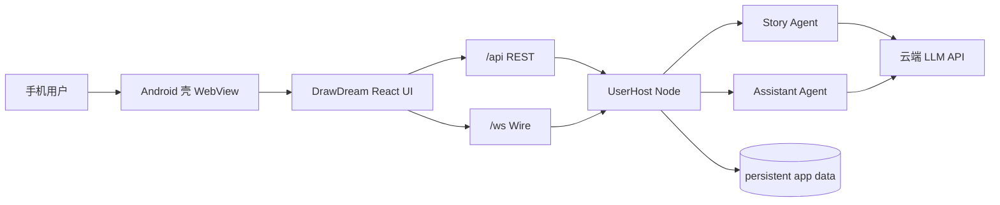

<div align="center">

<a href="https://github.com/RochelimitDawn/DrawDreamMAX">
  
</a>

# DrawDreamMAX

**方寸之间，绘梦天地**

面向手机的本地 AI 角色扮演客户端：内嵌 Node 运行时 + 绘梦 UI，记忆分层、抉择门禁、RP 结构化组件、世界线与双 Agent，单端口同源交付。

[](https://github.com/RochelimitDawn/DrawDreamMAX/stargazers)
[](https://github.com/RochelimitDawn/DrawDreamMAX/network/members)
[](./LICENSE)
[](https://github.com/RochelimitDawn/DrawDreamMAX/releases)


</div>

---

## 产品定位

| 项 | 说明 |
| --- | --- |
| **主交付物** | 签名安卓 APK（本地内嵌 Node + WebView） |
| **代码结构** | `mobile` 壳 + **同一套** React UI + DrawDream Agent |
| **入口端口** | **7620**（`/*` UI · `/api/*` REST · `/ws` Wire） |
| **LLM** | 云端 API（壳内不内嵌模型权重） |
| **当前发布版本** | `v2.0.0-alpha.1-mobile.62` |

> 仓库**只维护移动端主线**。`drawdream/src`（UI）与 `drawdream/agent`（运行时）是 APK 的必要组成部分，属于本地 Node 运行时之上的 Web UI 层，**请勿当作「可删的网页产品」拆除**。桌面 `npm run dev` 仅用于开发构建与联调。

```text
手机 APK
  ├─ Kotlin 壳 + WebView
  ├─ Termux aarch64 Node（jniLibs）
  └─ runtime.zip ──► agent/ + ui/  ──► 127.0.0.1:7620
```

架构、打包与发布细节见 **[docs/MOBILE.md](./docs/MOBILE.md)** · **[mobile/README](./drawdream/mobile/README.md)**。

---

## 核心能力

| 模块 | 能力 |
| --- | --- |
| 记忆分层 | 纯净上下文 · 结构化账本 · 世界书检索 · 剧情化压缩 |
| 抉择门禁 | 转折处 `ask_director` 选择卡；历史分岔可回看 |
| RP 结构化组件 | 原生 scene/char/widget 渲染（letter / quest / inventory 等），无 TokUI 依赖 |
| 小说工坊 | 合法 txt → 反向大纲 / 角色名单 / 草稿审阅 → 角色卡 + 世界书入库 |
| 资料库 | 人设 · 世界书 · 预设统一入口，保存后注入主对话 |
| 世界线 | `/store` 钉存档 · `/back` 回档 · `/line` 全景 |
| 双 Agent | 剧情只写剧情；助手侧栏管配置与诊断 |
| 单机模式 | `DD_AUTH_MODE=single`，APK 内静默本地会话、无账号门闩 |
| 生态兼容 | 角色卡 / 世界书 / 聊天记录导入；预设转换器；PureTavern 兼容适配与扩展运行时 |

---

## 架构概览



| 层 | 路径 | 职责 |
| --- | --- | --- |
| 壳 | `drawdream/mobile` | 启动 Node、WebView、权限与文件选择 |
| UI | `drawdream/src` → `dist` | 品牌、路由、页面、RP 组件、i18n |
| 适配 | `drawdream/src/agent` | 同源 REST / WS / session-store |
| 运行时 | `drawdream/agent` | 剧情 harness、账本、鉴权、持久化 |

---

## 获取 APK

1. 打开 [Releases](https://github.com/RochelimitDawn/DrawDreamMAX/releases) 下载最新 `app-release.apk`
2. 直接覆盖安装，应用会保留会话、角色卡、世界书和配置数据
3. 启动后先使用旧 runtime 进入界面，再后台准备新 runtime 并完成健康检查
4. **设置 → API** 配置云端 Key 与模型后即可开聊

当前仓库以 `v2.0.0-alpha.1-mobile.62` 作为移动端发布版本，采用清理后的单一主线。

mobile.62 APK：

```bash
https://github.com/RochelimitDawn/DrawDreamMAX/releases/tag/v2.0.0-alpha.1-mobile.62
```

远程仓库策略：默认分支仅 **`main`**；发布版本使用 `v2.0.0-alpha.1-mobile.N` 标签，GitHub Release 保留当前交付版本。

工作流：[`.github/workflows/release-apk.yml`](./.github/workflows/release-apk.yml)

| Secret | 说明 |
| --- | --- |
| `ANDROID_KEYSTORE_B64` | keystore base64（单行） |
| `ANDROID_KEYSTORE_PASSWORD` | store 密码 |
| `ANDROID_KEY_ALIAS` | 如 `drawdream-release` |
| `ANDROID_KEY_PASSWORD` | key 密码 |

---

## 开发者联调（构建 UI / Agent）

移动端 runtime 打包依赖已构建的 UI `dist` 与 agent packages。桌面联调仅服务构建与排障：

### 环境

- Node.js ≥ 22
- npm 10+
- 可选：Android SDK + JDK 17（本地打 APK）
- 全局 `tsgo`（`@typescript/native-preview`，构建 `agent/packages/*`）

### 安装与启动

```bash
git clone https://github.com/RochelimitDawn/DrawDreamMAX.git
cd DrawDreamMAX/drawdream

cp agent/drawdream.agent.example.json agent/drawdream.agent.json
cp agent/drawdream.config.example.json agent/drawdream.config.json
# 填写 apiKey / provider / model

npm install
npm run agent:install
npm run dev
```

默认：`http://127.0.0.1:7620`

| 命令 | 作用 |
| --- | --- |
| `npm run dev` | 构建 UI → 启动 Agent |
| `npm run dev:watch` | 开发时热构建 UI |
| `npm run build` | 输出 `dist/` |
| `npm run start` | 已有 dist 时仅启动服务 |
| `npm run agent:install` | 安装 Agent 依赖 |
| `npm run mobile:prepare` | 组装 runtime + 注入 jniLibs / assets |
| `npm run mobile:smoke` | 桌面冒烟（无需 SDK） |
| `npm run lint` | oxlint |

| 变量 | 默认 | 说明 |
| --- | --- | --- |
| `PORT` | `7620` | HTTP/WS 端口 |
| `HOST` | `0.0.0.0` | 监听地址（APK 内为 `127.0.0.1`） |
| `DRAWDREAM_UI_DIST` | `drawdream/dist` | UI 静态目录 |
| `DD_DATA_ROOT` | `agent/data` | 数据根 |
| `DD_AUTH_MODE` | （桌面可多用户） | APK 强制 `single` |

仓库根也可：`./scripts/dev-all.sh`

### 本地组装 APK 运行时

```bash
cd drawdream
npm run build
npm run mobile:node
npm run mobile:prepare
# 有 SDK 时：
cd mobile/android && ./gradlew :app:assembleDebug
```

---

## 页面与数据

| 路由 | 页面 | 数据 |
| --- | --- | --- |
| `/` · `/cards` | 角色卡库 | `/api/cards` |
| `/cards/:id` | 角色卡详情 | `/api/cards/detail` … |
| `/chat` | 对话 | WebSocket + 会话 REST |
| `/library` | 资料库枢纽 | 人设 / 世界书 / 预设入口 |
| `/novel-forge` | 小说工坊 | `/api/forge/*` |
| `/settings` | 设置 | 渠道 · 模型 · RP · 阅读 |
| `/world-info` | 世界书 | `/api/lorebooks` |
| `/persona` | 人设 | `/api/personas` |
| `/presets` | 预设 | `/api/presets` |
| `/plaza` | 广场 | 本地卡库 |

---

## 目录结构

```text
DrawDreamMAX/
|-- README.md
|-- LICENSE                         # PolyForm Noncommercial 1.0.0
|-- docs/MOBILE.md                  # 移动端架构与发布规范
|-- .github/workflows/release-apk.yml
|-- scripts/dev-all.sh
`-- drawdream/
    |-- public/brand/               # logo · favicon
    |-- src/                        # React UI（打进 APK ui/）
    |-- agent/                      # 本地 Node Agent（打进 APK agent/）
    |   |-- server/
    |   |-- src/
    |   |-- packages/               # @drawdream/* 内核（dist 构建后打进 APK）
    |   |-- EMBEDDED.md
    |   `-- LICENSE                 # 与仓库根一致：PolyForm NC
    |-- mobile/                     # Android 壳 · runtime 打包 · Gradle
    |   |-- README.md
    |   |-- scripts/
    |   `-- android/
    |-- scripts/
    `-- package.json                # 2.0.0-alpha.1
```

配置与密钥（勿提交密钥文件）：

| 文件 | 用途 | 入库 |
| --- | --- | :---: |
| `agent/drawdream.agent.example.json` | Key / 模型占位 | 是 |
| `agent/drawdream.agent.json` | 本地密钥 | 否 |
| `agent/drawdream.config.example.json` | RP 配置示例 | 是 |
| `agent/drawdream.config.json` | 本地 RP 配置 | 否 |

---

## 版本

| | |
| --- | --- |
| 产品 | **Alpha 2.0** |
| 包 | `2.0.0-alpha.1` |
| 当前 Release | **`v2.0.0-alpha.1-mobile.62`** |
| Agent | DrawDream Agent（手机内嵌 Node） |

### mobile.62 要点

- 安装包大幅精简：移动端 agent 树 ~80MB → 17MB（单文件 `single.mjs` 承载全部依赖，不再携带 `node_modules`）
- 环境工具链修正：node 恒显示「可用」，bun/ffmpeg/python 保留真实 PATH 探测并加安装提示
- 助手任务清单 UI：`todo_write` 清单实时展示（勾选动画/删除线/烟花，暖金主题）
- 记忆双路检索：`memory_search` 向量+词法双路，每轮摘要自动固化；「记忆宫」更名「记忆」
- 设置页「环境」分页：运行时/端口/工作区、磁盘占用、工具链探测
- Agent 单文件打包：`bundle-agent.mjs` 产出 14MB `single.mjs`
- 抉择器改进：抉择应答进正文、option/free 区分、停止本回合安全收尾
- 工具条汉化 + 相邻重复调用折叠；消息头像优化；模型失败可见；助手纯 markdown
- 继承 mobile.53-61：卡内 UI iframe 全量渲染、ST 兼容层、设置页便当盒

---

## Stars 与增长

> Star History 依赖 **公开仓库** 与 `api.star-history.com`。私有或 API 不可用时图可能空白，可打开 [Star History 页面](https://star-history.com/#RochelimitDawn/DrawDreamMAX&Date)。

<div align="center">

<a href="https://star-history.com/#RochelimitDawn/DrawDreamMAX&Date">
  
</a>

</div>

---

## 致谢与版权说明

- **早期产品思路**曾参考 [梨园 Liyuan](https://github.com/weidu12123/Liyuan) 的角色扮演 / Agent 工作台方向；**当前仓库代码已全面自研重构**，实现、UI、移动端运行时与产品逻辑均为 DrawDream 独立维护，**不再是梨园的分支或仿写副本**。
- Agent 内核部分包历史上游为 [pi](https://github.com/earendil-works/pi)（MIT），以各 `packages/*/LICENSE` 为准。
- 角色卡 / 世界书等数据格式兼容公开规范，未使用 SillyTavern 源码。

---

## 许可证

本项目（含绘梦 UI、移动端壳、DrawDream Agent 及文档）采用：

**[PolyForm Noncommercial License 1.0.0](./LICENSE)**

- 允许个人学习、研究、自用与非商业分发（以协议全文为准）
- **禁止商业用途**（销售、SaaS 收费、商业产品内嵌等，详见协议）
- 第三方子包若自带 MIT 等许可证，以包内文件为准；**自有业务代码与交付产品以根目录 PolyForm NC 为准**

```text
Required Notice: Copyright RochelimitDawn (https://github.com/RochelimitDawn/DrawDreamMAX)
```

---

<div align="center">


**DrawDreamMAX** · Alpha 2.0 · 移动端优先 · 方寸之间，绘梦天地

</div>
