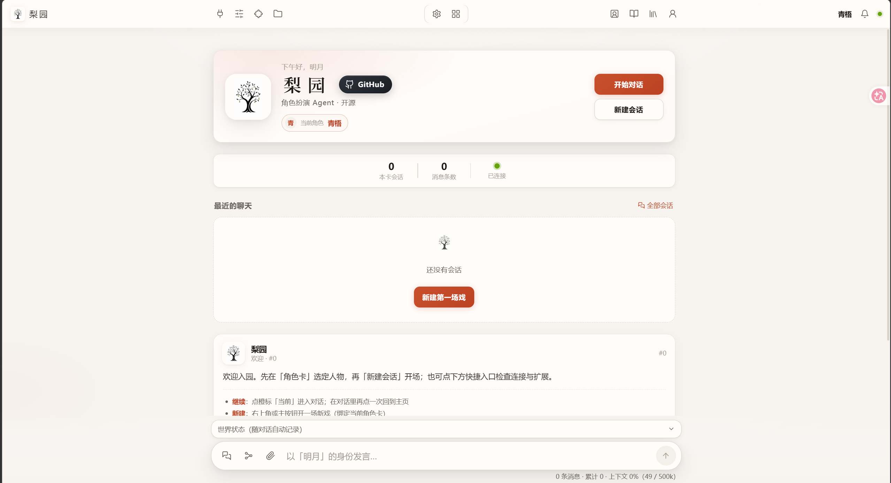

<div align="center">


# DrawDream Agent

**以 AI Agent 为主体的角色扮演运行时**

内嵌于 [DrawDreamMAX](https://github.com/RochelimitDawn/DrawDreamMAX) 的 Agent / RP 后端：HTTP · WebSocket · harness · 记忆 · 世界线 · 双 Agent。

</div>



---

## 是什么

DrawDream Agent 把 coding agent 的 harness、工具与会话能力翻译进角色扮演：过程性内容在架构层裁掉，模型只看见叙事正文与结构化快照；用户在关键分岔处做选择；Agent 可生成面板、管理知识库与素材库；剧情与系统事务由双 Agent 分治。

产品 UI 由上级 `../src` 提供，本目录负责运行时与领域逻辑。配置主名为 `drawdream.*` / 数据目录 `.drawdream-*`（启动时自动从历史 `drawdream.*` / `.drawdream-*` 迁移）。

---

## 创新点

### 1. 记忆优化——从 harness 拔高记忆上限

上下文是 RP 中最重要的资源。传统做法把全过程塞进窗口，冗余严重占用上下文。引入 harness 后，在架构层每轮重新剪辑上下文，模型只保留叙事正文与快照/账本等；过程性内容在代码层确定性裁掉，实测每轮省 53%–63%。同样的窗口，有效剧情容量翻倍。

完整记忆大致四层：

纯净上下文（工作记忆）→ 结构化账本（旁侧模型每轮记账：物品、好感、时间、伏笔）→ 检索资产（世界书+知识库，用时才取）→ 剧情化压缩（按叙事逻辑生成前情提要）。

### 2. 询问模式——用户深度参与剧情走向

coding agent 在删文件前会停下来问你。DrawDream 把这套翻译进 RP：重要新角色定型、关键设定落定、难以回头的重大转折时，Agent 停笔弹出选择卡——几个方向 + 自由输入。选完剧情按你定的走，卡片永久留痕，岔路口可回看。

解决的是传统 RP 只能重 roll 拆盲盒的问题：用户直接决定走向。

### 3. 面板——Agent 生成可视化 UI

前端操作权交给 Agent：可生成装备库、SVG 地图等面板，并随扮演实时更新，让扮演可视化。

### 4. 扩展——Skill 与 MCP

文生图等能力可沉淀为 skill；MCP 默认全关，按对话开启。比传统插件抠关键词、硬接线更轻。

### 5. 世界线——存档 / 回档 / 分支

`/store` 钉存档，`/back` 回档，`/line` 看世界线全景。回档回的是整个世界：正文、账本、面板、知识库挂载一致回到该时间点。压缩过的上下文在回到压缩前存档时自动恢复全量原文。

### 6. 知识库

用户与 Agent 共同维护；扮演中可随时写入新设定，按需挂载。

### 7. 素材库

上传与生成文件落盘，消息里只附路径，降低上下文占用；可从素材库拖回输入框。

### 8. 双 Agent 分治

剧情模型只写剧情；「助手」独立会话，全局视角（配置、账本、诊断、技能），绝不代写剧情。输入 `//` 或括号包裹可转给助手。

---

## 兼容性

1. **角色卡**：PNG / JSON 直接导入，卡内嵌世界书一并读取  
2. **世界书**：JSON 导入；蓝灯 constant / 绿灯关键词语义保留；知识库可导出回 ST 世界书格式  
3. **聊天记录**：jsonl 导入续玩，自动清洗旧状态栏与思维链，摘要建账  
4. **预设**：提供转换器；部分为旧一问一答架构补偿的块在 harness 下可能失效，请自行实测  

明确不兼容：正则脚本、STscript、前端插件、角色卡自带 HTML 界面。

> 未使用任何 SillyTavern 代码，全部格式解析按公开规范独立实现。兼容的是数据生态。

---

## 快速开始

前置：**Node.js ≥ 22**，任一 OpenAI 兼容 API Key。

在 **DrawDream 应用根**（本目录上一级 `drawdream/`）启动为推荐方式：

```bash
cd ..   # 进入 drawdream/

cp agent/drawdream.agent.example.json agent/drawdream.agent.json
cp agent/drawdream.config.example.json agent/drawdream.config.json
# 编辑 drawdream.agent.json → apiKey 与模型 id

npm install && npm run agent:install
npm run dev
```

- 浏览器打开控制台打印的地址（默认 `http://127.0.0.1:7620`）
- 仅本目录独立跑：`npm install && npm run web`（需自行准备 UI dist 或设 `DRAWDREAM_UI_DIST`）

配置分两份：

- **`drawdream.config.json`**：角色卡 / 世界书 / 用户身份等（面板可改）
- **`drawdream.agent.json`**：模型与 Key（**勿提交仓库**）

多用户与数据目录见 [MULTI_USER.md](./MULTI_USER.md)。内嵌边界见 [EMBEDDED.md](./EMBEDDED.md)。

---

## 进阶

- **斜杠命令**：`/state` · `/lore` · `/import` · `/store` · `/back` · `/line` · `/rewind` · `/branch` · `/compact` 等  
- **MCP**：扫描 Claude / Cursor / 项目配置；默认全关，扩展面板按对话开启  
- **TTS**：`DRAWDREAM_TTS_BASE_URL` + `DRAWDREAM_TTS_API_KEY`（或 `OPENAI_API_KEY`）  
- **技能**：`.drawdream-skills/` 下 markdown  

## 已知边界

- 不运行角色卡正则脚本与独立 HTML 前端  
- 看图需要视觉模型  
- 预设在 agent 架构下效果需实测  
- 决策卡分寸、建面板与入库积极性与模型智能正相关  
- 剧情正文永远是模型原始输出：代码与辅助模型只做输入侧加工与记账，不改写正文  

## 开发者

```text
领域层  src/        card / lorebook / state / director / retention /
                    scribe / panels / codex / worldline / mcp …
接线层  .drawdream/extensions/roleplay.ts
Web 层  server/     WS + REST + 静态托管
内核    packages/   历史包名 @drawdream/*（agent 运行时，pi fork，file: 本地依赖）
```

```bash
node --test test/*.test.ts
node scripts/smoke-web.mjs
```

产品数据目录：`.drawdream-state/` · `.drawdream-artifacts/` · `.drawdream-codex/` · `.drawdream-uploads/` · `.drawdream-skills/` 等，纯 JSON / 文件，可备份迁移。

## 许可证

- 主项目采用 **[PolyForm Noncommercial 1.0.0](LICENSE)**：源码开放，个人与非商业用途可自由使用、修改、分发；商业用途需单独授权。  
- `packages/` 下内核 fork 自 [pi](https://github.com/earendil-works/pi)（MIT）。

## 致谢

- 早期设计与 harness 思路参考 [梨园 DrawDream](https://github.com/weidu12123/DrawDream)（weidu12123）。DrawDream 在其基础上做了大量魔改与产品化（绘梦 UI、多用户、UserRuntime 池等），现作为本仓库 **DrawDream Agent** 独立维护。  
- 内核 [pi](https://github.com/earendil-works/pi)（MIT，Copyright Mario Zechner）。  
